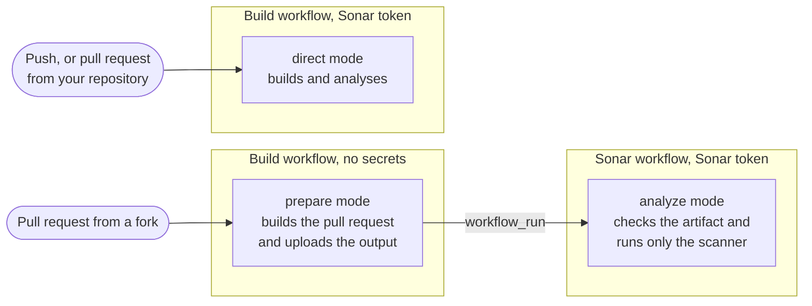

# Sonar Fork Analysis

[](https://github.com/EvaristeGalois11/sonar-fork-analysis/actions/workflows/ci.yml)
[](https://github.com/EvaristeGalois11/sonar-fork-analysis/actions/workflows/fixtures.yml)
[](https://github.com/EvaristeGalois11/sonar-fork-analysis/actions/workflows/scanner.yml)
[](https://github.com/EvaristeGalois11/sonar-fork-analysis/actions/workflows/codeql.yml)
[](https://scorecard.dev/viewer/?uri=github.com/EvaristeGalois11/sonar-fork-analysis)
[](https://sonarcloud.io/summary/new_code?id=evaristegalois11_sonar-fork-analysis)
[](https://sonarcloud.io/summary/new_code?id=evaristegalois11_sonar-fork-analysis)

<!-- prettier-ignore -->
> [!NOTE]
> v2 is under development and not released yet, so `@v2` doesn't resolve. This
> README describes v2.

Runs Sonar analysis, with coverage and test results, on pull requests from
forks.

GitHub doesn't give secrets to workflows triggered by a fork, so the usual Sonar
setup can't analyse their pull requests. This action splits the work in two. The
build workflow builds the pull request without the Sonar token. A second
workflow then analyses the result with the token, without running any of the
pull request's code. It's the split
[Sonar's documentation describes for forks](https://docs.sonarsource.com/sonarqube-cloud/analyzing-source-code/ci-based-analysis/github-actions-for-sonarcloud#analyzing-fork-pull-requests),
packaged for Maven, Gradle and any other project Sonar's scanner analyses, such
as JavaScript, TypeScript or Python. Binaries, libraries, coverage, test reports
and the settings your build defines all carry over.

If you don't need coverage on fork pull requests, SonarQube Cloud's
[Automatic Analysis](https://docs.sonarsource.com/sonarqube-cloud/advanced-setup/automatic-analysis/)
handles forks with no setup. It has no coverage, doesn't support monorepos and
analyses some languages in less depth.

## Documentation

- [Security](docs/security.md): what the analysis trusts and how to harden your
  setup.
- [Troubleshooting](docs/troubleshooting.md): what each message means.

## How it works



On a pull request from a fork:

1. Your build workflow runs without the Sonar token. The action builds the
   project with Maven or Gradle and has Sonar's build plugin work out the
   analysis settings without running the analysis. For other projects, the
   action doesn't build anything: it runs after your own build and test steps
   and reads your `sonar-project.properties`. It uploads what the analysis needs
   as an artifact, together with those settings: compiled classes, libraries,
   coverage and test reports. For a Node project, that includes the type
   declarations from `node_modules`.
2. When the build finishes, GitHub starts your Sonar workflow through
   `workflow_run`. It runs in your repository, so it has the Sonar token.
3. The action checks out the pull request, checks the artifact's settings
   against an allowlist and runs the Sonar scanner on the sources and the build
   output. It never runs the build or anything else from the pull request. Sonar
   shows the results on the pull request as usual.

On pushes and pull requests from your own repository, the build has the token,
so the action analyses straight away, as Sonar's own plugins and scanner would.
The Sonar workflow still starts after the build but has nothing to do.

Dependabot's pull requests run without your Actions secrets, like forks, so they
take the fork path too.

You don't have to pick any of this. The `mode` input defaults to `auto`, which
chooses the right part from where the action runs and whether it has a token.

## Setup

1. Create a Sonar token and save it as the repository secret `SONAR_TOKEN`.
   SonarQube Cloud's free plan only has personal tokens, so use a dedicated one
   named after your repository. Paid plans can use a
   [scoped organization token](https://docs.sonarsource.com/sonarqube-cloud/administering-sonarcloud/managing-organization/scoped-organization-tokens)
   with only _Execute analysis_ on the project. An expiry date is optional, but
   a token without one is removed after 60 days without use.
2. Gradle builds need the `org.sonarqube` plugin, 2.1 or later. Maven builds
   need nothing: the action runs the latest `sonar-maven-plugin` or the version
   your pom pins in `<plugins>` or `<pluginManagement>`, which must be 3.2 or
   later. Dependabot can keep either up to date.
3. Add the action to your build workflow:

   ```yaml
   name: Build
   on:
     push:
       branches: [main]
     pull_request:
   permissions:
     contents: read
   jobs:
     build:
       runs-on: ubuntu-latest
       steps:
         # Your existing checkout and Java setup. Sonar needs the full history.
         - uses: actions/checkout@v7
           with:
             persist-credentials: false
             fetch-depth: 0
         - uses: actions/setup-java@v6
           with:
             distribution: temurin
             java-version: 21
         # Add this in place of your build step.
         - uses: evaristegalois11/sonar-fork-analysis@v2
           with:
             project-key: my-org_my-project
             sonar-organization: my-org
             sonar-token: ${{ secrets.SONAR_TOKEN }}
   ```

   The action runs the build itself, `verify` for Maven and `check` for Gradle
   (see [`build-goals`](#inputs)). Trigger the workflow on `pull_request`, not
   `pull_request_target`. With `pull_request_target`, a fork's code would run
   with your secrets, so the action refuses to build there.

4. Add the Sonar workflow, triggered by the build:

   ```yaml
   name: Sonar
   on:
     workflow_run:
       workflows: [Build]
       types: [completed]
   jobs:
     sonar:
       if: github.event.workflow_run.conclusion == 'success'
       runs-on: ubuntu-latest
       permissions:
         actions: read
         contents: read
         pull-requests: read
         statuses: write
       steps:
         - uses: evaristegalois11/sonar-fork-analysis@v2
           with:
             project-key: my-org_my-project
             sonar-organization: my-org
             sonar-token: ${{ secrets.SONAR_TOKEN }}
   ```

   Use the same `project-key` in both workflows, because it also names the
   artifact. `statuses: write` is optional, see
   [commit statuses](#commit-statuses-and-required-checks).

If you pin your other actions to commit SHAs, pin this one too. The
[security page](docs/security.md#hardening-your-setup) has more hardening
advice.

### Other projects

For other projects, such as JavaScript, TypeScript, Python, Go or PHP, add the
action after your own build and test steps. The action doesn't build anything.
It runs Sonar's scanner, which reads its settings from your
`sonar-project.properties`, just like Sonar's own scan action. The action
recognises these projects by that file or by a `package.json`. For a Node
project:

```yaml
steps:
  # Your existing checkout and Node setup. Sonar needs the full history.
  - uses: actions/checkout@v7
    with:
      persist-credentials: false
      fetch-depth: 0
  - uses: actions/setup-node@v6
    with:
      node-version: 24
  - run: npm ci
  # Write coverage where sonar-project.properties says, e.g. coverage/lcov.info.
  - run: npm test -- --coverage
  # Add this after your tests.
  - uses: evaristegalois11/sonar-fork-analysis@v2
    with:
      project-key: my-org_my-project
      sonar-organization: my-org
      sonar-token: ${{ secrets.SONAR_TOKEN }}
```

```properties
sonar.sources=src
sonar.tests=test
sonar.javascript.lcov.reportPaths=coverage/lcov.info
```

Other languages have their own report settings, such as
`sonar.python.coverage.reportPaths=coverage.xml` for Python. The Sonar workflow
doesn't change. For a Node project, the action also passes the type declarations
in your `node_modules` to the Sonar workflow, along with the links npm, Yarn and
pnpm make there. Rules that need types then work on pull requests from forks
too, even across the packages of a monorepo.

### Which commit the build tests

On a pull request, `actions/checkout` checks out a merge of the pull request
into the base branch, but the Sonar workflow analyses the pull request's head.
This rarely matters. It only affects files that changed both in the pull request
and on the base branch since the pull request branched off. Their binaries and
coverage then come from slightly different code, and the only visible sign is
usually a scanner warning such as _Cannot import coverage information for file_.

If you want the two to match exactly, check out the head in the build:

```yaml
- uses: actions/checkout@v7
  with:
    persist-credentials: false
    fetch-depth: 0
    ref: ${{ github.event.pull_request.head.sha }}
```

This changes what your whole build tests on pull requests, so only do it if
you're happy with that.

## Inputs

| Input                | Required             | Default            | Description                                                                                                                                                                                             |
| -------------------- | -------------------- | ------------------ | ------------------------------------------------------------------------------------------------------------------------------------------------------------------------------------------------------- |
| `project-key`        | Yes                  |                    | The Sonar project key. Use the same one in the build and the Sonar workflow.                                                                                                                            |
| `sonar-organization` | For SonarQube Cloud  |                    | The Sonar organization.                                                                                                                                                                                 |
| `sonar-token`        | Yes                  |                    | The Sonar token. It's empty on pull requests from forks, which makes the action take the fork path.                                                                                                     |
| `sonar-host-url`     | For SonarQube Server |                    | The server URL. Leave it empty for SonarQube Cloud or to use the `SONAR_HOST_URL` environment variable. Direct analyses also fall back to the build's own `sonar.host.url`, the Sonar workflow doesn't. |
| `mode`               | No                   | `auto`             | `auto`, or `direct`, `prepare`, `analyze` to force one part.                                                                                                                                            |
| `working-directory`  | No                   | `.`                | The directory holding the project.                                                                                                                                                                      |
| `build-tool`         | No                   | `auto`             | `auto`, `maven`, `gradle` or `scanner`, see [other projects](#other-projects).                                                                                                                          |
| `build-goals`        | No                   | `verify` / `check` | Maven goals or Gradle tasks to run. Not with `scanner`.                                                                                                                                                 |
| `build-arguments`    | No                   |                    | Extra build flags. In the Sonar workflow they're passed to the scanner instead, for example `-Dsonar.projectName=App`. The scanner doesn't run in the checkout there, so use absolute paths.            |
| `checkout`           | No                   | `true`             | Whether the Sonar workflow checks out the analysed commit. `false` to do it yourself, see [your own checkout](#your-own-checkout).                                                                      |
| `github-token`       | No                   | `github.token`     | Used to download the build's artifact and look up the pull request.                                                                                                                                     |

`build-goals` and `build-arguments` take one entry per line, so write several as
a YAML block:

```yaml
build-goals: |
  clean
  install
build-arguments: |
  -Pci
  -DskipITs
```

## Commit statuses and required checks

Sonar posts its own check on every analysed pull request, such as _SonarCloud
Code Analysis_. On pull requests from forks it arrives once the Sonar workflow
has run, a little after the build's own checks. To block merging until the
analysis passes, require that check in your branch rules, with the Sonar app as
its source. If the fork path fails, the check never arrives, so merging stays
blocked.

With `statuses: write`, the Sonar workflow also posts a status called _Sonar
fork analysis (your project key)_, so you can see why a check is missing. It's
pending while the analysis runs, then turns to success or failure. It links to
the run. It's only posted for pull requests that take the fork path, so don't
require it, or pull requests from your own repository can never be merged.

## Recipes

### Several projects

Run the action once per project, each with its own project key and
`working-directory`, for example with a matrix. In the build workflow:

```yaml
jobs:
  build:
    strategy:
      matrix:
        include:
          - project-key: my-org_service-a
            working-directory: service-a
          - project-key: my-org_service-b
            working-directory: service-b
    runs-on: ubuntu-latest
    steps:
      # Your existing checkout and Java setup.
      - uses: evaristegalois11/sonar-fork-analysis@v2
        with:
          project-key: ${{ matrix.project-key }}
          working-directory: ${{ matrix.working-directory }}
          sonar-organization: my-org
          sonar-token: ${{ secrets.SONAR_TOKEN }}
```

The Sonar workflow only needs the project keys:

```yaml
jobs:
  sonar:
    if: github.event.workflow_run.conclusion == 'success'
    strategy:
      matrix:
        project-key: [my-org_service-a, my-org_service-b]
    runs-on: ubuntu-latest
    # Same permissions as for a single project.
    steps:
      - uses: evaristegalois11/sonar-fork-analysis@v2
        with:
          project-key: ${{ matrix.project-key }}
          sonar-organization: my-org
          sonar-token: ${{ secrets.SONAR_TOKEN }}
```

If the build skips a project, for example because none of its files changed,
that project's Sonar job ends without doing anything.

### Skipping runs with nothing to do

The Sonar workflow runs after every build and stops straight away when the build
analysed directly. To skip it completely, run its job only for forks and
Dependabot:

```yaml
if: >
  github.event.workflow_run.conclusion == 'success' &&
  (github.event.workflow_run.head_repository.full_name != github.repository ||
   github.event.workflow_run.actor.login == 'dependabot[bot]')
```

### Builds that don't always run the action

The Sonar workflow expects every build it follows to have run the action.
Otherwise it reports that the build left nothing to analyse. If the build
ignores some changes, ignore them in its trigger, so the Sonar workflow never
starts:

```yaml
on:
  pull_request:
    paths-ignore: ['docs/**']
```

If the build skips the action on some events, skip them in the Sonar job too:

```yaml
if: >
  github.event.workflow_run.conclusion == 'success' &&
  github.event.workflow_run.event != 'schedule'
```

### Only for forks, next to another Sonar setup

If you already analyse your own pull requests and pushes another way, such as
with Sonar's own action, you can use this action for forks and Dependabot only.
In the build, run it only on those pull requests and without a token, so it
always takes the fork path:

<!-- prettier-ignore -->
```yaml
- uses: evaristegalois11/sonar-fork-analysis@v2
  if: >
    github.event.pull_request.head.repo.fork ||
    github.actor == 'dependabot[bot]'
  with:
    project-key: my-org_my-project
    sonar-organization: my-org
```

In the Sonar workflow, use the job condition from
[skipping runs](#skipping-runs-with-nothing-to-do).

### Your own checkout

The action checks out the analysed commit itself. Set `checkout: false` to do it
yourself, for example to get submodules or Git LFS files. Your checkout must be
at the analysed commit, with full history and no persisted credentials. Its
`origin` must point at your repository, which is where Sonar finds the base
branch.

```yaml
- uses: actions/checkout@v7
  with:
    ref: ${{ github.event.workflow_run.head_sha }}
    fetch-depth: 0
    persist-credentials: false
    submodules: true
- uses: evaristegalois11/sonar-fork-analysis@v2
  with:
    checkout: false
    # …
```

## Real-world examples

[Instancio](https://github.com/instancio/instancio) analyses its pull requests
from forks with this action, on a Maven build with 38 modules. See its
[build workflow](https://github.com/instancio/instancio/blob/main/.github/workflows/build.yml)
and
[Sonar workflow](https://github.com/instancio/instancio/blob/main/.github/workflows/sonar.yml).

This repository analyses itself with the action too. It's a TypeScript project
that runs the scanner after its tests, with a `sonar-project.properties` file.
See its [build workflow](.github/workflows/ci.yml) and
[Sonar workflow](.github/workflows/sonar.yml).

## Limitations

- .NET projects need Sonar's scanner for .NET, and C and C++ projects need
  Sonar's build wrapper. Neither works with this action.
- Yarn's Plug'n'Play installs, the default since Yarn 2, have no `node_modules`,
  so no type declarations reach pull requests from forks, and rules that need
  types find less there. Yarn's `nodeLinker: node-modules` setting avoids it.
- When the action runs the scanner, it reads settings only from
  `sonar-project.properties` and `build-arguments`. Unlike Sonar's npm scanner,
  it doesn't guess any from `package.json`, so set your coverage report path
  yourself.
- On the fork path, the build collects its settings with simulation mode
  (`sonar.scanner.internal.dumpToFile`), a feature of the Sonar plugins for
  Maven and Gradle and of the pinned scanner. Sonar uses it in its own tests but
  doesn't document it, so a release could change it. If it stops working, the
  build fails with _its Sonar plugin wrote no analysis settings_ or _the Sonar
  scanner succeeded but wrote no analysis settings_. This project's tests keep
  up with the latest plugins, so such a change should show up here first.
- Dependency analysis (SCA) and the engine's build-system autoconfiguration are
  off on fork pull requests, because both run the project's build tools. See
  [what stays off](docs/security.md#what-stays-off-on-the-fork-path).
- Settings about the server, the scanner or the branch, and settings that would
  start a program, don't reach the Sonar workflow. The build warns about each
  one. See
  [what the fork path carries](docs/security.md#what-the-fork-path-carries).
- The build's `sonar.region` isn't carried. For SonarQube Cloud's US region, add
  `-Dsonar.region=us` to `build-arguments` in the Sonar workflow.
- The action looks for `mvnw` and `gradlew` only in `working-directory`, not in
  parent directories. On Windows runners it never runs `mvnw.cmd` or
  `gradlew.bat`.
- Where the scanner has no build with Java bundled, it needs Java on the `PATH`.
  Alpine images can't run the bundled Java. Projects on a newer Java than the
  scanner's may need `setup-java` and `-Dsonar.java.jdkHome` in
  `build-arguments`.
- Each release of the action runs one fixed version of the Sonar scanner, which
  you can't change. To get a newer one, update the action.
- SonarQube Server needs an edition that supports pull request analysis. The
  action is tested against SonarQube Cloud and the latest SonarQube Community
  Build.

## Migrating from v1

v1 stays on its tags but gets no more fixes, security fixes included. Move to
v2, and if v1 has analysed pull requests from forks, rotate your Sonar token.
See [security](docs/security.md#v1) for why.

In v1, the Sonar workflow analysed every build. In v2, the build analyses pushes
and your own pull requests itself, and the Sonar workflow only analyses pull
requests from forks and Dependabot.

In the build workflow, the action replaces your build step and now gets the
token. Before:

```yaml
steps:
  - uses: actions/checkout@v7
  - uses: actions/setup-java@v6
    with:
      distribution: temurin
      java-version: 21
  - run: mvn install
  - uses: evaristegalois11/sonar-fork-analysis@v1
```

After:

```yaml
steps:
  - uses: actions/checkout@v7
    with:
      persist-credentials: false
      fetch-depth: 0
  - uses: actions/setup-java@v6
    with:
      distribution: temurin
      java-version: 21
  - uses: evaristegalois11/sonar-fork-analysis@v2
    with:
      project-key: my-org_my-project
      sonar-organization: my-org
      sonar-token: ${{ secrets.SONAR_TOKEN }}
```

v2 runs `verify` for Maven and `check` for Gradle. It no longer needs `install`.
If your build step ran other goals or flags, move them to `build-goals` and
`build-arguments`.

In the Sonar workflow, the action no longer sets up Java and needs a few more
permissions. Before:

```yaml
jobs:
  sonar:
    if: github.event.workflow_run.conclusion == 'success'
    runs-on: ubuntu-latest
    permissions:
      actions: read
    steps:
      - uses: evaristegalois11/sonar-fork-analysis@v1
        with:
          distribution: temurin
          java-version: 21
          github-token: ${{ secrets.GITHUB_TOKEN }}
          sonar-token: ${{ secrets.SONAR_TOKEN }}
          project-key: my-org_my-project
```

After:

```yaml
jobs:
  sonar:
    if: github.event.workflow_run.conclusion == 'success'
    runs-on: ubuntu-latest
    permissions:
      actions: read
      contents: read
      pull-requests: read
      statuses: write
    steps:
      - uses: evaristegalois11/sonar-fork-analysis@v2
        with:
          project-key: my-org_my-project
          sonar-organization: my-org
          sonar-token: ${{ secrets.SONAR_TOKEN }}
```

`sonar-organization` is new. v1 took the organization from your build, but v2's
Sonar workflow only takes it from this input. `github-token` now defaults to the
workflow's own token, so you can drop it.

## Development

`npm run all` formats, lints, type-checks, tests and bundles into `dist/`, which
is committed.

`npm run test:scanner` runs the tests against the real scanner. They download
the scanner and SonarQube's engines. They need Java and `unzip`. If Sonar ships
an engine that starts processes in new places, they fail until someone reviews
`__tests__/java/engine-processes-*.txt`.

The action pins the scanner CLI by hash. When the weekly Scanner run reports a
newer one, run `npm run scanner:update`, which pins it with the digests Sonar
publishes, then `npm run bundle`, and open a pull request.

To run the action locally, copy `.env.example` to `.env`, edit it and run
`npm run local`.

Dependabot pull requests that update runtime dependencies fail CI until `dist/`
is rebuilt. Run `npm ci && npm run bundle` on the branch, or commit the `dist`
artifact the failed run uploads.

Third-party actions added to a workflow must also be added to the repository's
allowed actions.

## Security

Report vulnerabilities as described in [SECURITY.md](SECURITY.md). How the
action protects your token is explained in [security](docs/security.md).

## License

[MIT](LICENSE).

This project is not affiliated with or endorsed by SonarSource. Sonar, SonarQube
and SonarCloud are trademarks of SonarSource.
